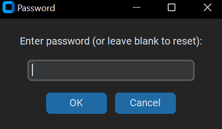
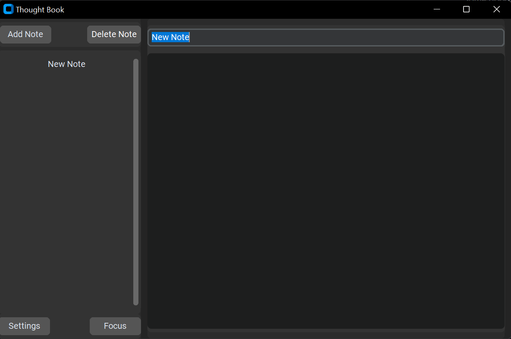

# Thought Book ✍️  
_A dedicated, offline, and private space for your thoughts._  

---

## 🌍 Why I Built It  
I often wanted to capture a thought quickly, but:  
- No pen around.  
- Google Notes didn’t work offline.  
- Notepad left private notes exposed.  

---

## 💡 The Solution  
- Opens instantly with a shortcut.  
- Works fully offline.  
- Encrypts notes for privacy.  
- Backups to Google Drive (lightly encrypted).  

---

## 🖼️ Demo  

---

## 🚀 How to Use  
1. Clone the repo  
2. Run `deploy.py`  
3. Press your shortcut → start writing

---

## 🔒 Privacy First  
Your notes are stored locally, encrypted, and and manually backed up securely to your Drive.

---

## ⚠️ Notes
For full documentation of the app, visit the documentation of this project [here](./docs/README.md)

# Download
If you don't have python on your computer, you can just download it here: [Thought Book app](https://github.com/Mahmudumar/thought_book/releases/latest)