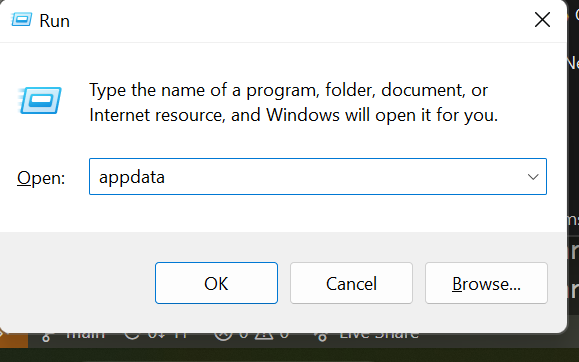
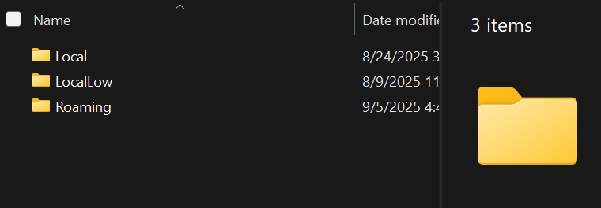
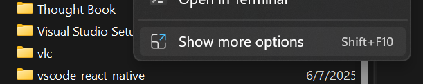
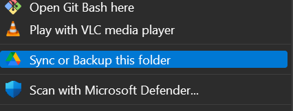

## How to backup notes
When you want to back up your notes, you can follow these simple steps:

1. Download and install Google Drive for desktop.

2. Go to the `roaming` folder in `appdata` of your computer.

    - can't find the roaming folder? Just press Windows + R and type `appdata`. Then press enter. 
    

    - This will open the appdata folder which you can enter the `Roaming` folder from.
    

3. Find the `Thought Book` folder and right click that and click on show more options.

4. Then click on the Backup or Sync this folder option.

## Notes
* **All notes' content are encrypted in the database using a simple caesar cipher**

* The backup process requires internet connection and the `Thought Book` folder is less than 1MB depending on what's inside. If you want to backup only the `BMTbnotes.db` you can backup only that instead of the entire folder.

